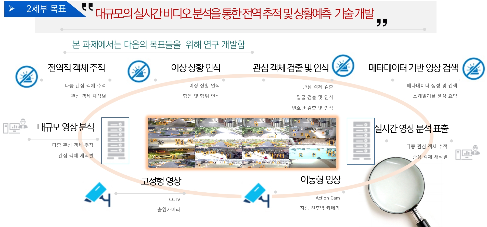

# Deepview_Sub2 (딥뷰-2세부) 2020

## 1 Description
   * Deepview_sub2 Zoo: A list of deepview_sub2 methods. Papers, codes and datasets are maintained. 

   * Datasets for deepview are available at the [website](https://github.com/nnUyi/DerainZoo/blob/master/DerainDatasets.md).

## 2 전역 추적 기술
### 2.1 Multi-Object Tracking (MOT)
* GMPHD-OGM_Tracker (GIST) [[paper]](https://ieeexplore.ieee.org/abstract/document/8897600/) [[code]](https://github.com/SonginCV/GMPHD-OGM_Tracker
) (Access'20)
* Deep-TAMA (GIST) [[paper]](https://www.sciencedirect.com/science/article/pii/S0020025520309890) [[code]](https://github.com/yyc9268/Deep-TAMA) (AVSS'19, Information Sciences'20)

### 2.2 Re-ID
* SCT4 (GIST) [[paper]](https://ieeexplore.ieee.org/abstract/document/8897600/) [[code]](https://github.com/yoon28/SCT4DukeMTMC
) 

## 3 이상상황 인식 기술
### 3.1 GAN-Based Method
* Adversarial_IFTN [[paper](https://arxiv.org/abs/2001.11175)] [[code](https://github.com/andreYoo/Adversarial_IFTN
)] (IV'2020)
### 3.2 Graph Convolutional Network
* Adversarial_IFTN [[paper](https://arxiv.org/abs/2003.07514)] [[code](https://github.com/andreYoo/PeGCNs
)] (Arxiv'2020)

## 4 번호판 검출 및 인식 기술
* SNIDER [[paper](https://openaccess.thecvf.com/content_ICCVW_2019/html/RLQ/Lee_SNIDER_Single_Noisy_Image_Denoising_and_Rectification_for_Improving_License_ICCVW_2019_paper.html)] [[code](https://github.com/brightyoun/LPSR-Recognition
)] (VISAPP'19, ICCVW'19)
* Adversarial_IFTN [[paper](https://arxiv.org/abs/2003.07514)] [[code](https://github.com/andreYoo/PeGCNs
)] (Arxiv'2020)
* Adversarial_IFTN [[paper](https://arxiv.org/abs/2003.07514)] [[code](https://github.com/andreYoo/PeGCNs
)] (Arxiv'2020)

## 5 다중 객체 검출 기술
* PSNR (Peak Signal-to-Noise Ratio) [[paper]](https://ieeexplore.ieee.org/stamp/stamp.jsp?tp=&arnumber=4550695) [[matlab code]](https://www.mathworks.com/help/images/ref/psnr.html) [[python code]](https://github.com/aizvorski/video-quality)

## 6 메타데이터 검색 기술
* PSNR (Peak Signal-to-Noise Ratio) [[paper]](https://ieeexplore.ieee.org/stamp/stamp.jsp?tp=&arnumber=4550695) [[matlab code]](https://www.mathworks.com/help/images/ref/psnr.html) [[python code]](https://github.com/aizvorski/video-quality)

## 7 ETC
* PSNR (Peak Signal-to-Noise Ratio) [[paper]](https://ieeexplore.ieee.org/stamp/stamp.jsp?tp=&arnumber=4550695) [[matlab code]](https://www.mathworks.com/help/images/ref/psnr.html) [[python code]](https://github.com/aizvorski/video-quality)
